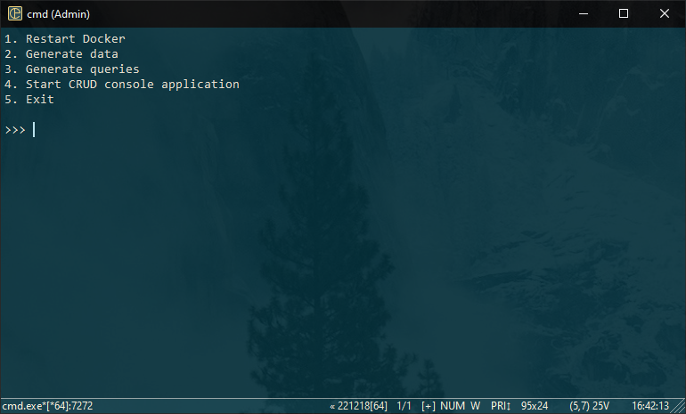

# Домашнє завдання #7

Робота з базою [`PostgreSQL`](https://www.postgresql.org/)[^1] за допомогою [`ORM SQLAlchemy`](https://www.sqlalchemy.org/)[^2].

[^1]: `PostgreSQL` (або просто `Postgres`) - це потужна об'єктно-реляційна система управління базами даних (СУБД), що забезпечує збереження, організацію та маніпулювання даними. Вона є одним із найпопулярніших відкритих реляційних баз даних.
[^2]: `Object-Relational Mapping` - Технологія програмування, яка пов'язує бази даних із концепціями об'єктно-орієнтованих мов програмування, створюючи "віртуальну об'єктну базу даних".

## Установка і запуск проекту

Для управління залежностями проекту використовується `pipenv`. Необхідно встановити `pipenv` перед виконанням наступних кроків:

- Склонируйте репозиторий:

  ```shell
  git clone https://github.com/sergiokapone/goit_python_web_hw7.git
  ```

- Для встановлення залежностей використайте команду `pipenv install` або `pipenv sync`.

## Сртуктура проекту

```text
.
├── alembic/
│   ├── versions/           # Директорія з файлами міграцій
│   └── env.py
├── database/
│   ├── db.py               # Код для керування підключенням до бази даних
│   ├── models.py           # Визначення моделей даних
│   └── repository.py       # Код виконання операцій CRUD
├── Pipfile
├── alembic.cmd             # Робота з міграціями
├── docker_run.cmd          # Запуск контейнера з базою даних
├── alembic.ini             # Налаштування alembic
├── config.ini              # Налаштування для підключення до бази даних
├── README.MD
├── main.py                 # Код CLI для операцій CRUD
├── my_select.py            # Код для запитів до бази даних
└── seed.py                 # Код для заповнення бази даних початковими даними
```

## Запуск бази данних

Для запуску бази данних запустіть файл `docker_run.cmd`, або команду

```shell
docker run --name students -p 5432:5432 -e POSTGRES_PASSWORD=password -d postgres
```

## Створення міграцій

Для створення міграцій скористайтесь файлом `alembic.cmd`.
Меню скрипта має вигляд:

```text
1. Generate a migration
2. Apply all migrations
3. Rollback the last migration
4. View the current migration status
5. Exit
```

## Заповнення бази даних

Для заповнення бази даних можна скористатись командою `python seed.py`. Файл `seed.py`
містить сценарій для генерації випадкових даних про студентів,
вчителів та оцінки, а також їх додавання в базу даних. Групи та предмети генеруються не випадково, а задаються в коді у вигляді списків всередині файлу.

## CLI для CRUD

`main.py` є інтерфейсом командного рядка (CLI). який дає змогу взаємодіяти з базою даних студентів із командного рядка, виконуючи різні операції ([CRUD](https://uk.wikipedia.org/wiki/CRUD)) з об'єктами моделей: створення, оновлення, видалення, отримання інформації та виведення списку:

```shell
usage: main.py [-h] [--action ACTION] [--model MODEL] [--id ID] [--name NAME] [--subject SUBJECT] [--value VALUE]

Students DB

options:
  -h, --help            show this help message and exit
  --action ACTION, -a ACTION
                        Commands: create, get, update, remove, list
  --model MODEL, -m MODEL
                        Models: Teacher, Group, Student, Subject, Grade
  --id ID               ID of the object
  --name NAME, -n NAME  Name of the object
  --subject SUBJECT, -s SUBJECT
                        Subject of the object
  --value VALUE, -v VALUE
                        Value of the object
```

### Приклади виконання команд у терміналі.

- Показати всіх вчителів: `python main.py -a list -m Teacher`
- Створити вчителя: `python main.py -a create -m Teacher -n "Mister X"`
- Ооновити дані вчителя з `id=3`: `python main.py -a update -m Teacher --id 3 -name "Andry Bezos" `
- Показати всі групи: `python main.py -a list -m Group`
- Створити групу: `python main.py -a create -m Group -n "AD-101"`
- ...

## Демонстація роботи застосунку (відеофрагмент)

[](https://www.youtube.com/watch?v=hYscVxaG_Es)

## Допоміжний софт

Для роботи з базою данних сожна використати [HeidiSQL](https://www.heidisql.com/download.php)

`HeidiSQL` дозволяє переглядати і редагувати дані і структури з комп'ютерів, на яких працює одна з систем баз даних `MariaDB`, `MySQL`, `Microsoft SQL`, `PostgreSQL` і `SQLite`.
